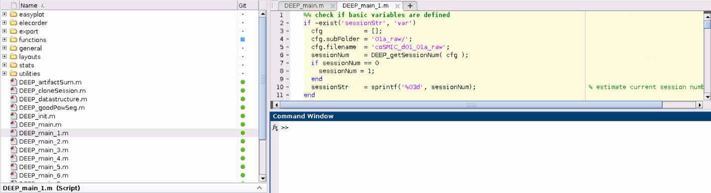
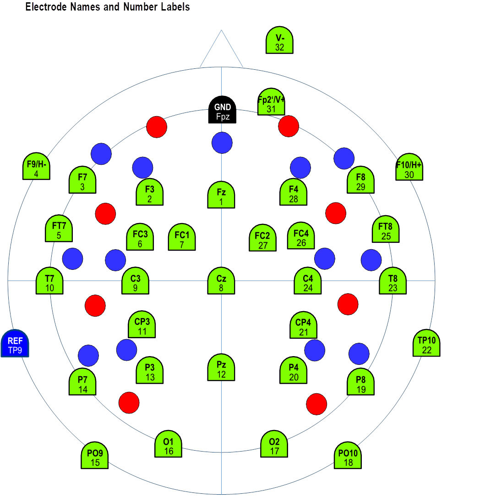
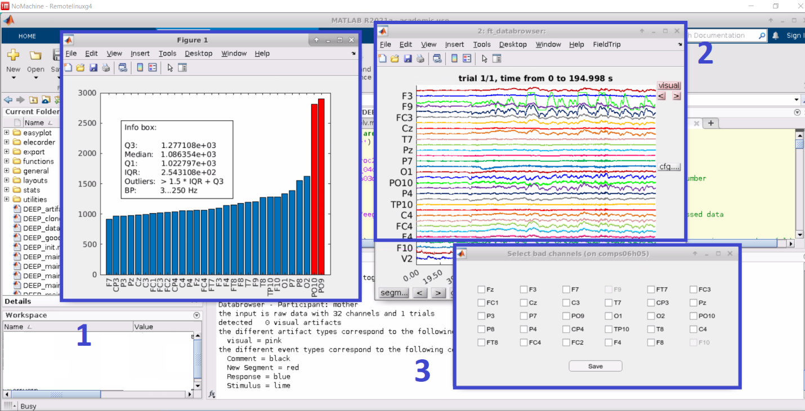
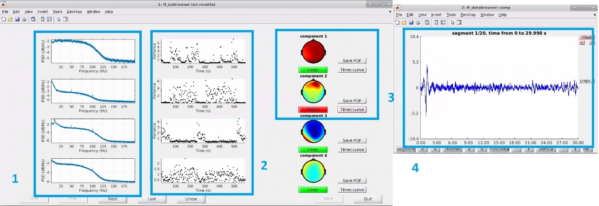
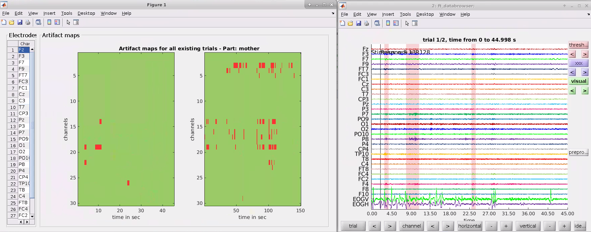
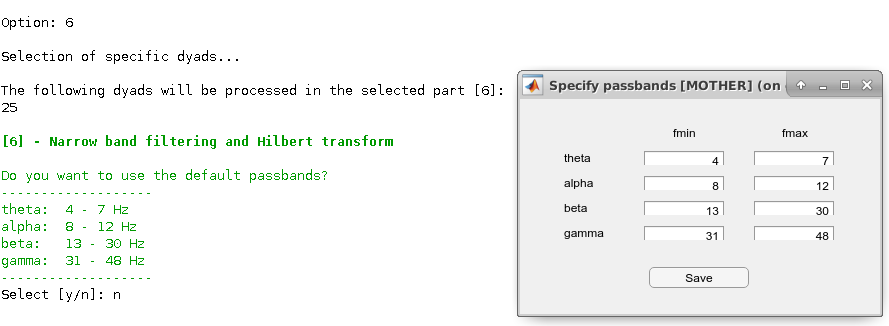
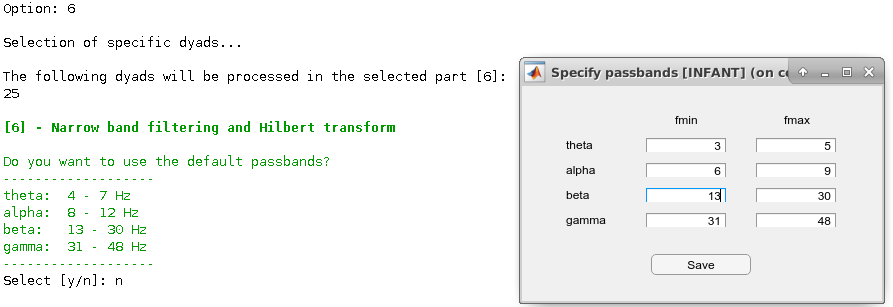

# MPI_CBS-DEEP

## DEEP: A dual-EEG Pipeline for adult and infant hyperscanning studies. - User Manual

### Table of Contents
1. [ Overview. ](#overview)
2. [Setup and Run (DEEP_main).](#setupRun)
3. [\[1\] Data Import (DEEP_main_1)](#1)
4. [\[2\] Preproc I: Bad Channel Detection, Filtering (DEEP_main_2)](#2)
5. [\[3\] Cleaning prior to ICA (DEEP_main_3)](#3)
6. [\[4\] Preproc II: ICA-based Artifact Correction, Bad Channel Recovery, Re-referencing (DEEP_main_4)](#4)
7. [\[5\] Automatic and Manual Artifact Detection (DEEP_main_5)](#5)
8. [\[6\] Narrow Band Filtering and Hilbert Transform (DEEP_main_6)](#6)
9. [\[7\] Estimation of Phase Locking Values (PLV) and cross-frequency PLVs (DEEP_main_7)](#7)
10. [\[8\] Power analysis (TFR, pWelch) (DEEP_main_8)](#8)
11. [\[9\] Averaging over dyads (DEEP_main_9)](#9)

<a name="overview"></a>
### Overview

The pipeline was initially designed to analyze data from a mother-infant hyperscanning study conducted in our lab. We reasoned that more researchers could benefit from the pipeline, and started the process of adjusting the functionalities of the pipeline to address the needs of a general user. Because this is work in progress, in the current version of the pipeline, users would need to adjust the “DEEP_generalDefinitions.mat” script to be able to proceed with the pipeline. This script includes information specific to our study such as the EEG markers used to indicate the events or the duration of the conditions. In Table S1, we present information on the DEEP_generalDefinitions.mat file used to analyze the data in the paper. 

Table S1: The attributes of the DEEP_generalDefinitions.mat file that are relevant to the analyses reported in the paper.

Attributes|Content|Description
:---|:------------------|:---
artfctMark:|{'S 4' 'S 5' 'S 3'}|Markers indicating periods that will be deleted from the analyses such as reaks. S4: Pause, S5: Resume, S3: Quit
artfctNum:|[4 5 3]|Numeric form of artfct
atfctString:|{3x1 cell}|Cell array of string, artfct
condMark:|{'S 11' 'S 13'}|Markers indicating the conditions analyzed in the current paper. S11: Free play condition, S13: Resting state condition Please note that the original experiment includes other conditions, which are not relevant to the analyses reported in this paper.
condMarkDual:|{'S 11' 'S 13'}|Dual condition markers used for the analyses of the example dataset.
condNum:|[11 13]|Numeric form of condMark
condNumDual:|[11 13]|Numeric form of condMarkDual
condString:|{2x1 cell}|Cell array of string, cond
duration:|[150 45]|The duration of the free play and resting state conditions, respectively, in seconds.
trialNum1sec:|[150 45]|The total number of trials in the free play and resting state conditions, respectively, in one second epochs.
trialNum5sec:|[30 9]|The total number of trials in the free play and resting state conditions, respectively, in five second epochs.

The pipeline is based on functions of the FieldTrip toolbox (https://www.fieldtriptoolbox.org/). Users are expected to download the FieldTrip toolbox independently. Once it is downloaded and set up correctly (see startup.m), one can type **“ft_version”** in the MATLAB command window to get the latest version of the FieldTrip toolbox. One can also clone and use a certain version of the FieldTrip toolbox to operate the pipeline.

In order to operate the pipeline and analyze the data, each researcher can create their own session. In one session, data for each processing step is saved. Several sessions for the same study can operate in parallel without interfering with one another. Thus, several researchers can work simultaneously on the data analysis. Preprocessing steps completed in one session can be copied to another session using the **“DEEP_cloneSession”** script. Within each session, the user can choose from several processing steps. Whereas preprocessing steps 1 to 6 have to be done in a fixed order, users can proceed with the subsequent steps (e.g., steps 7 or 8) depending on the analysis of their choice.

The user launches the pipeline by typing the **“DEEP_main”** command in the MATLAB command window. Following this, the user is asked to select the default path or define a new path on their computer where the raw data are stored. The processed data and the final exported data will also be saved under this path. Next, the user chooses the participants’ data to be processed among three options 1) all available dyads 2) all new dyads 3) a specific subsample of dyads. This gives flexibility to users especially when they want to exclude some of the participants’ data from the start or to perform the processing steps with a subsample of participants reducing preprocessing time and effort.

After the dyads are selected, the pipeline allows the user to choose the processing steps that are available for the imported data files (e.g., if no data was imported for a certain participant, no later processing steps can be selected). This function also helps the user to remember which preprocessing steps are completed for which dyads. In the current version of the pipeline, the same preprocessing steps are applied to both the mother and the infant data. For each preprocessing step, first, the data of the adult is processed followed by the data of the infant/child. When processing data of two adult participants, the pipeline first processes data of participant 1 followed by data of participant 2. After each processing step, data files are restored separately as *.mat files. Below, we will illustrate each processing step in detail and introduce the main functions used at each step.

<a name="setupRun"></a>
### Setup and Run (DEEP_main)

After downloading the project files from the GitHub repository (https://github.com/dmatthes1982/MPI_CBS-DEEP), run MATLAB. After opening MATLAB, make sure that you are working with the right directory. Otherwise, switch to "…/DEEP_eeg_pipeline directory". Check the following:

```
>> pwd
ans =
'/data/UserName/MATLAB/scripts/ DEEP/DEEP_eeg_pipeline'
```
DEEP scripts should be ready to run in the MATLAB command window when you are in the right directory. If not, check if you have successfully installed the FieldTrip toolbox and the project files.



To launch the pipeline, type the following in the command window in MATLAB:

```
>> DEEP_main
```

```
---------------------------------------------------------------------------------------
DEEP: A dual-EEG Pipeline for adult and infant hyperscanning studies. - data processing
Version: 0.2
Copyright (C) 2018-2021, Daniel Matthes, MPI CBS
---------------------------------------------------------------------------------------

The default paths are:
Source: /data/pt_01888/eegData/DualEEG_DEEP_rawData/
Destination: /data/pt_01888/eegData/DualEEG_DEEP_processedData/

Do you want to select the default paths?
Select [y/n]: y

The following sessions are available: 1
The session owners are:
```

This command runs the **“DEEP_main”** script. **“DEEP_main”** selects sessions, data processing steps and dyads. Select "y" for default paths. Select **"n"** to add a new path. Enter a previous session number (i.e., enter session number such as 1 or 2) or create a new one (i.e., enter 0). Please note that each session data will be saved separately. A user can create more than one session to operate them simultaneously, if needed. You have to select the same number to continue your previous work in that session. **Importantly**, if a previously completed step is rerun within the same session, previous data will be overwritten. In the default path, the pipeline generates a “00_Settings” file that lists the parameters and user choices for preprocessing within a particular session.

```
Please select one session or create a new one:
[0] - Create new session
[num] - Select session

Session: 0

Please select one option:
[1] - Process all available dyads
[2] - Process all new dyads
[3] - Process specific dyads
[4] - Quit data processing

Option: 3
```

For illustration purposes, we will process a few dyads. Select **"3"** to process a specific dyad.

**DEEP_main functions:**  
- **DEEP_init:** Adds directory and subfolders to the path.
- **DEEP_main_1 to DEEP_main_9:** Subscripts for data processing.

Next, we will explain each main data processing step and its associated functions in detail.

<a name="1"></a>
### \[1\] Data Import (DEEP_main_1)

Select **"1"** to import data.

```
A new session always will start with part:
[1] - Import raw data
```

Then, select the dyads listed in the pop-up window (e.g., 25). This selection runs the **“DEEP_main_1”** script. **“DEEP_main_1”** imports EEG files from the source location. The user is asked to choose the electrodes to include in the data import. Select "1” to import all of the channels. Select "3" to exclude a specific set of channels (e.g., the ones on the periphery). In the pop-up window, choose the channels you would like to exclude from the start. Click **"OK."**

```
[1] - Data import

Select channels, which are NOT of interest?
[1] - import all channels
[2] - reject T7, T8, PO9, PO10, P7, P8, TP10
[3] - reject specific selection
Option: 
```

As shown below, we used a customized channel configuration (*EASYCAP GmbH*, Germany) to record the data presented in the paper. Green points illustrate the EEG channel names and numbers. “V” and “H” refer to vertical and horizontal eye electrodes, respectively. Blue and red points represent optode locations for functional near-infrared spectroscopy (fNIRS), which were kept empty during the recordings of the data used in the paper, as we only measured dual EEG in this experiment.



**Important note:** In the current version of the pipeline, only data recorded with the Brain Products system can be analyzed. If you are using another system, you can convert your data and process it outside of the GUI. In this link (https://github.com/dmatthes1982/MPI_CBS-DEEP/tree/master/dataconversion), we provide two example scripts: 1) to convert data obtained with a BioSemi system (i.e., in .bdf format) 2) to call DEEP sub-functions to operate the pipeline afterwards. Users can open the “DEEP_importBdf” function and copy their dataset into a folder on their computers and change the directory to the destination of the dataset. Further instructions can be found in the scripts.

**DEEP_main_1 functions:**  
- **DEEP_getSessionNum:** Estimates current session number.
- **DEEP_createTbl:** Creates settings file.
- **DEEP_importDataset:** Imports the data of each dyad.
- **DEEP_saveData:** Stores the data in a .mat file. 

**Additional functions:**
- **DEEP_loadData:** Loads data of a previous step.
- **DEEP_selectData:** Selects data.

Some of these basic functions are used in the upcoming steps as well. To avoid redundancy, we only describe them here.

<a name="2"></a>
### \[2\] Preproc I: Bad Channel Detection, Filtering (DEEP_main_2)

Continue data processing by selecting **"y"**. If you have stopped the processing after step 1, select step "2" to proceed. This selection runs the **“DEEP_main_2”** script. **“DEEP_main_2”** has two sub-steps:1) selection of bad/noisy channels 2) applying a basic bandpass filter for an initial cleaning of channels. By default, one can mark a maximum of 10 % of the total channels as noisy. If needed, this limit can be deactivated in the code. Three pop-up windows appear to help you choose the channels to be interpolated:

- Figure 1 shows the total power of each channel and highlights outliers by marking them red. Channels are marked as bad/noisy channels when their total power from 3Hz (to suppress eye artifacts and baseline drifts) is below Q1 - 1.5 * IQR or above Q3 + 1.5 * IQR.
- Figure 2 uses the ft_databrowser function of FieldTrip to plot the raw signal for each channel across time.
- Figure 3 shows the pop-up window for selecting the channels to interpolate.



Select bad/noisy channels that you would interpolate later and click **"Save."** When choosing the channels to be interpolated, we recommend the users to check the neighboring channels that are used for interpolation (for more information on neighboring channels, please see https://github.com/fieldtrip/fieldtrip/tree/master/template/neighbours). Note that horizontal and vertical electrooculograms (EOGs), namely EOGH and EOGV, cannot be interpolated, thus, they cannot be selected. 

**DEEP_main_2 functions:** 
- **DEEP_concatData:** Concatenates all trials of a dataset to a continuous data stream.
- **DEEP_estNoisyChan:** Detects noisy channels automatically. 
- **DEEP_selectBadChan:** Selects corrupted channels. 
- **DEEP_preprocessing:** Applies a basic bandpass filter [1-48 Hz] to the raw data.

<a name="3"></a>
### \[3\] Cleaning prior to ICA (DEEP_main_3)

Continue data processing by selecting **"y."** If you have stopped the processing after step 2, select step **"3"** to proceed. This selection will run the **“DEEP_main_3”** script. **“DEEP_main_3”** (1) concatenates preprocessed trials into a continuous stream, (2) detects artifacts and rejects transient artifacts (criterion: within a 200 ms segment with a 50 % overlap \[i.e., 100 ms\], the difference between the maximum and the minimum voltage cannot be more than 200 μV), (3) concatenates cleaned data into a continuous stream, (4) runs ICA decomposition, (5) extracts EOG channels from the cleaned continuous data.

**DEEP_main_3 Functions:**  
- **DEEP_concatData:** Concatenates all of the preprocessed trials into a continuous data stream.
- **DEEP_autoArtifact:** Detects transient artifacts given the criterion above.
- **DEEP_mergeThArtResults:** Merges two artifact detection operations (i.e., based on all electrodes vs. eye electrodes) into a common one.
- **DEEP_rejectArtifacts:** Rejects previously detected transient artifacts.
- **DEEP_ica:** Conducts an independent component analysis (ICA) on the data using all channels except eye electrodes and the reference electrode.
- **DEEP_selecdata:** Extracts EOG channels from the cleaned continuous data.

<a name="4"></a>
### \[4\] Preproc II: ICA-based Artifact Correction, Bad Channel Recovery, Re-referencing (DEEP_main_4)

Continue data processing by selecting **"y."** If you have stopped the processing after step 3, select step **"4"** to proceed. This selection will run the **“DEEP_main_4”** script. **“DEEP_main_4”** (1) finds ICA components for eye movements, which show a minimum of 80 % (i.e., default value) correlation with EOGV and EOGH, (2) verifies the estimated components by using the ft_icabrowser function, and allows the user to add additional components to the selection, (3) corrects the EEG data, (4) recovers bad channels, and (5) applies an offline re-referencing method.

```
Option: 4

Selection of specific dyads...

The following dyads will be processed in the selected part [4]:
25 

[4] - Preproc II: ICA-based artifact correction, bad channel recovery, re-referencing

Determine available channels...
Please select favoured reference:
[1] - Common average reference
[2] - Linked mastoid ('TP9', 'TP10')
[3] - Robust average reference
Option: 
```

Select **”1”** for re-referencing using the common average method. 
Select **”2”** for re-referencing using the linked mastoids method. 
Select **”3”** for re-referencing using the robust averaging method. 

Next, select **”y”** to use the default threshold (i.e., 0.8) for the estimation of eye movement components. If you want to change the threshold value, select **”n”** and define another value.

```
Do you want to use the default threshold (0.8) for EOG-artifact estimation with mother data?
Select [y/n]: y

Dyad 25
ICA-based artifact correction

Load ICA result...
Load original EOG channels...

Determine EOG-correlating components at mother...
Determine EOG-correlating components at child...

Select ICA components which shall be subtracted from mother's data...
Select components to reject!
Components which exceeded the selected EOG correlation threshold are already marked as bad.
These are:
[1] - component 2 - 88.2 % correlation
[2] - component 10 - -93.8 % correlation
```

This selection opens the *ft_icabrowser* window to inspect eye movement artifacts. The pipeline highlights detected components by marking them as **"Reject"**. This can be undone by clicking on the **"Reject"** tab once, which turns into **”Keep”**. As illustrated below, *ft_icabrowser* (for more information, see https://www.fieldtriptoolbox.org/reference/ft_icabrowser/) presents a GUI showing the 1) power spectrum, 2) variance over time, 3) the topography of the components, and 4) time course of the rejected components. There is an option to save this information as a *.pdf* file. Click **"Quit"** after checking the components.



**DEEP_main_4 Functions:** 
- **DEEP_detEOGComp:** Determines components that are highly correlated (> 80%) with the eye electrodes (i.e., EOGV and EOGH).
- **DEEP_selectBadComp:** Allows the user to check estimated ICA components and change the predetermined components.
- **DEEP_correctSignals:** Removes artifacts from the data. 
- **DEEP_repairBadChan:** Repairs bad channels that were selected at step 2.
- **DEEP_robustRef:** Runs robust average re-referencing method.
- **DEEP_reref:** Conducts re-referencing based on the selection (i.e., either common average or linked mastoids re-referencing methods).

<a name="5"></a>
### \[5\] Automatic and Manual Artifact Detection (DEEP_main_5)

Continue data processing by selecting **"y."** If you have stopped the processing after step 4, select step "5" to proceed. This selection will run the **“DEEP_main_5”** script. **“DEEP_main_5”** runs (1) automatic artifact detection, (2) manual artifact detection (verification). You can choose among the four automatic artifact detection methods and adjust the thresholds manually:

```
Continue data processing with:
[5] - Automatic and manual detection of artifacts?

Select [y/n]: y

[5] - Automatic and manual artifact detection

Please select an artifact detection method:
[1] - minmax threshold
[2] - range threshold within 200us, sliding window
[3] - stddev threshold within 200us, sliding window
[4] - mutiple of median absolute deviation, sliding window
Option: 1

Do you want to use the default thresholds (mother: 75 µV - child: 75 uV)  for automatic artifact detection?
Select [y/n]: y

Do you want to mark segments as artificats in which channels are dead or in saturation?
Select [y/n]: y

Do you want to include all channels in artifact detection?
Select [y/n]: y

Do you want to load existing manual selected artifacts?
Select [y/n]: y
```

Select **"1"** for the min-max threshold (default: 'minmax', +-75 µV).

Select **"2"** for the range threshold within 200ms, sliding window. 

Select **"3"** for the std dev threshold within 200ms, sliding window. 

Select **"4"** for the multiple of median absolute deviation, sliding window. 

Select **"y"** to use the default threshold of +-75 µV. Select **"y"** to mark dead channels. Select **“y”** to include all channels in artifact detection. Select **"y"** to load artifacts that were selected manually at step 2. If you haven’t marked any artifacts manually, type **“n”**.



This selection opens artifact maps for each condition across time and channels as well as the *ft_databrowser* window to inspect artifacts. On the left side of the artifact maps, the number of detected artifacts for each channel is listed. In the *ft_databrowser* window, segments that contain artifacts are marked red. Users can visually inspect the artifacts, mark certain segments as artifacts manually, or undo a previous selection. Close the tabs by clicking “x” after checking the artifacts.

**Note:** Manually selected artifacts from a certain session can be added to another session by duplicating the files named *“\*_allart_00OldSessionNumber.mat”* from one session and changing the filename to *“\*_allart_00NewSessionNumber.mat”*. We recommend the users to use this functionality carefully to avoid potential errors because the file holds both the automatic and manually defined artifacts. It is only recommended to make this copy if the user wants to run step 5 of the pipeline afterwards. In that case, choose the option "import existing manually defined artifacts."

**DEEP_main_5 Functions:**
- **DEEP_autoArtifact:** Marks segments as artifacts in which channels exceed a selected threshold based on the chosen method.
- **DEEP_manArtifact:** Verifies automatically detected artifacts and marks manually detected artifacts.

<a name="6"></a>
### \[6\] Narrow Band Filtering and Hilbert Transform (DEEP_main_6)

Continue data processing by selecting **"y."** If you have stopped the processing after step 5, select step "6" to proceed. This selection will run the **“DEEP_main_6”** script. **“DEEP_main_6”** handles narrow band filtering and Hilbert transformation.

```
[6] - Narrow band filtering and Hilbert transform

Do you want to use the default passbands?
-------------------
theta:  4 - 7 Hz
alpha:  8 - 12 Hz
beta:   13 - 30 Hz
gamma:  31 - 48 Hz
-------------------
Select [y/n]:
```

Select **"y"** to use the default passbands. These passband selections are only recommended when analyzing dual EEG data with older participants such as two adults. To define separate frequency ranges for the adult and the infant/child data, type **"n"** and enter passband values manually. Two separate windows will open to define adult and infant passbands.




**DEEP_main_6 Functions:**
- **DEEP_pbSelectbox:** Displays a GUI window for the specification of passbands. It returns a cell array including the minimum and maximum frequencies of each passband.
- **DEEP_bpFiltering:** Applies a specified bandpass filter to every channel in the data.
- **DEEP_hilbertPhase:** Estimates the Hilbert phase of every channel. 

<a name="7"></a>
### \[7\] Estimation of Phase Locking Values (PLV) and cross-frequency PLVs (DEEP_main_7)

Continue data processing by selecting **"y"**. If you have stopped the processing after step 6, select step "7" to proceed. This selection will run the **“DEEP_main_7”** script. **“DEEP_main_7”** (1) segments Hilbert phase data for PLV or cross-frequency PLV estimations and splits the data of every condition into sub-trials of 1 or 5 seconds epochs, (2) executes artifact rejection, (3) estimates PLVs or cross-frequency PLVs, (4) estimates mean PLVs or cross-frequency PLVs.

```
Continue data processing with:
[7] - Estimation of Phase Locking Values (PLV)?

Select [y/n]: y

[7] - Estimation of Phase Locking Values (PLV) or Cross Spectrum Phase Locking Values (crossPLV)

Should rejection of detected artifacts be applied before PLV estimation?
Select [y/n]: y

Do you want to use default segment durations?
-------------------
theta:  5 sec
alpha:  1 sec
beta:   1 sec
gamma:  1 sec
-------------------
Select [y/n]: y
```

Select **“y”** to use the predefined epoch durations for each frequency band. Type **“n”** to define different epoch durations for each frequency band manually.

**Important note**: DEEP automatically proceeds with either PLV or cross-frequency PLV estimations depending on the passbands defined at step 6. If there are no differences between the passband values of the two participants, DEEP will run PLV calculations. If differences are detected between the passband values of the two participants, cross-frequency PLVs will be estimated.

**DEEP_main_7 Functions:** 
- **DEEP_segselectBox:** Specifies the duration of epochs for later segmentation of the data.
- **DEEP_Segmentation:** Segments Hilbert phase data into epochs of predefined length.
- **DEEP_rejectArtifacts:** Executes the removal of segments containing artifacts which were defined at earlier steps.
- **DEEP_crossPhaseLockVal:** Calculates the cross-frequency PLVs for each channel combination in all of the conditions.
- **DEEP_phaseLockVal:** Calculates the PLVs for each channel combination in all of the conditions.
- **DEEP_calcMeanPLV:** Calculates the mean PLVs or cross-frequency PLVs for each condition.
- **DEEP_writeTbl:** Exports the numbers of good trials used for PLV or cross-frequency PLV estimations into a spreadsheet.

<a name="8"></a>
### \[8\] Power analysis (TFR, pWelch) (DEEP_main_8)

Continue data processing by selecting **"y."** If you have stopped the processing after step 6, select step "8" to proceed. This selection will run the **“DEEP_main_8”** script. **“DEEP_main_8”** calculates 1) time-frequency responses (TFRs), and 2) power spectral densities (PSDs) of the preprocessed data. This step is used to analyze EEG data for each participant individually.

```
[8] - Power analysis (TFR, pWelch)

Should the time-frequency response calculated?
Select [y/n]: y

Dyad 32
Load preprocessed data...
```

Select **"y"** to calculate the TFRs. 

```
Should the power spectrum by using Welch's method be calculated?
Select [y/n]: y

Should rejection of detected artifacts be applied before power estimation?
Select [y/n]: y
```

Select **"y"** to calculate the PSDs. Select **"y"** to reject artifacts that were defined at previous steps.

**DEEP_main_8 Functions:**
- **DEEP_timeFreqanalysis:** Performs a time-frequency analysis (for more information, see https://www.fieldtriptoolbox.org/reference/ft_freqanalysis/).
- **DEEP_segmentation:** Segments Hilbert phase data into epochs of predefined length for each condition.
- **DEEP_numOfSeg:** Estimates the number of segments for each condition and participant.
- **DEEP_rejectArtifacts:** Removes segments containing artifacts. 
- **DEEP_pWelch:** Calculates power activity using Welch's method.

<a name="9"></a>
### \[9\] Averaging over dyads (DEEP_main_9)

Continue data processing by selecting **"y."** If you have stopped the processing after step 7 or 8, select step **"9"** to proceed. This selection will run the **“DEEP_main_9”** script. “DEEP_main_9” averages PLVs, TFRs and PSDs across dyads or participants.

```
[9] - Averaging over dyads

Averaging mPLVs over dyads?
Select [y/n]: y
```

Select **"y"** to average PLVs or cross-frequency PLVs over dyads. Select dyads for averaging.

```
Averaging TFR over dyads?
Select [y/n]: y

Averaging power over dyads?
Select [y/n]: y
```

Select **"y"** to average TFRs over participants. Select **"y"** to average PSDs over participants. Select participants’ numbers to take the average of their data.

**DEEP_main_9 Functions:**
- **DEEP_mPLVoverDyads:** Calculates the mean of the PLVs or cross-frequency PLVs for each condition across all dyads.
- **DEEP_TFRoverDyads:** Calculates the mean of the time-frequency responses (TFRs) for each condition across all participants.
- **DEEP_powOverDyads:** Calculates the mean of the power spectral densities (PSDs) for each condition across all participants.

**Important note:** We publish a dual EEG dataset of 35 mothers and their infants together with these pipeline instructions.
